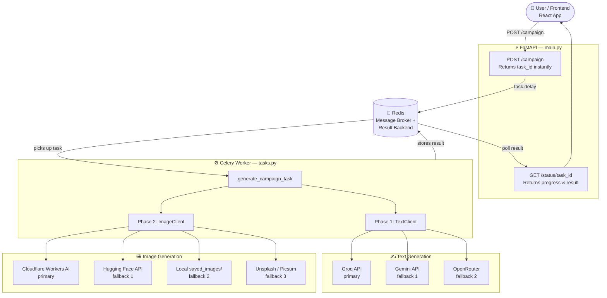

# AI Marketing System

The ai_marketing_system is a multi-modal AI content generation engine designed to streamline digital marketing workflows by processing a single product brief to simultaneously generate platform-optimized copywriting, SEO metadata, and complementary visual assets. Under the hood, it leverages a decoupled, highly scalable architecture combining a modern React frontend with a high-performance Python FastAPI backend. To ensure a seamless user experience without server timeouts, long-running AI API calls are intelligently offloaded to an asynchronous Celery and Redis task queue. Ultimately, this tool acts as a digital force multiplier, drastically reducing campaign creation time while maintaining consistent, multi-platform brand messaging.

---

## 📁 File System Diagram

```
AI_Marketing_System/
│
├── .env
├── .gitignore
├── config.py
├── requirements.txt
├── start_all.py
├── test_system.py
├── response_output.json
├── README.md
├── saved_images/
│
├── week_1_multimodal_api/               ← Multimodal API Integration Layer
│   ├── __init__.py
│   ├── prompt_templates.py
│   ├── text_client.py
│   └── image_client.py
│
├── week_2_async_queue/                  ← Async Task Queue (FastAPI + Celery + Redis)
│   ├── __init__.py
│   ├── celery_app.py
│   ├── tasks.py
│   ├── main.py
│   └── worker.py
│
├── week_3_parallel_execution/           ← Parallel Execution (upcoming)
│
└── week_4_dashboard/                    ← React Frontend Dashboard (upcoming)
```

---

## 🏗️ System Architecture



---

## 🛠️ Tools & Technology

| Category | Tool / Technology | Purpose |
|---|---|---|
| **Backend Framework** | FastAPI | High-performance async REST API server |
| **Task Queue** | Celery | Distributed background task processing |
| **Message Broker** | Redis | Task queue broker + result storage |
| **LLM (Primary)** | Groq API | Ultra-fast text generation |
| **LLM (Alternative)** | Google Gemini API | Text generation (gemini-flash / pro) |
| **LLM (Fallback)** | OpenRouter API | Unified gateway to 100+ AI models |
| **Image Gen (Primary)** | Cloudflare Workers AI | FLUX / Stable Diffusion image generation |
| **Image Gen (Fallback)** | Hugging Face Inference API | Text-to-image & image-to-image generation |
| **Frontend** | React + Vite | Interactive campaign dashboard UI |
| **Config Management** | python-dotenv | Environment variable loading from `.env` |
| **Data Validation** | Pydantic | Request/response schema validation |
| **Language** | Python 3.x | Backend logic and API clients |
